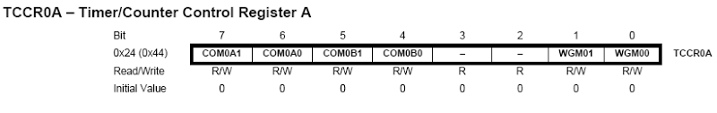
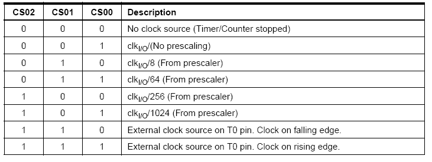
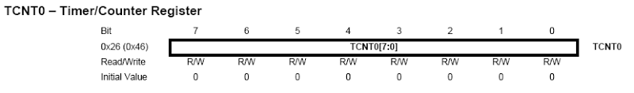

## 從 Arduino 到 AVR 晶片(3) -- Timers (作者：Cooper Maa)

### Timers 簡介

簡單地說，Timer 是計時器，可以用來量時間。

來自石英振盪器脈衝 (pulse) 每一個 clock 會來一次，Timer 的內容會跟著計數遞增。所以，如果使用的是 16 MHz 的振盪器，Timer 的內容會每 62.5 ns (奈秒) 改變一次。

根據解析度的不同，Timer 通常有 8-bit 和 16-bit 兩種。如果是 8-bit Timer，那麼可以寫入的最大數值是 255 (16-bit 的話是 65535)，假如超過了最大數值，Timer 就會自動 reset 為 0，這種情況稱為溢位 (overflow)。Timer overflow 的時候可以引發中斷，如果啟用了 Timer overflow 中斷，那麼你就必須在程式裏提供 ISR 處理中斷。

Timer 也可以當成一般的計數器 (Counter) 使用，或者是做 PWM 訊號輸出以及捕捉外部脈衝寬度 (Input Capture)。

### Prescaler

Prescaler (預除器) 是一個用來提供 clock 給 Timer 的電路。如你所知，CPU clock 頻率通常是 1 MHz, 8 MHz, 16 MHz，而 Precaler 的用途則是除頻。

AVR 晶片的 Precaler 大部份都有提供底下這些選項:

* No Clock Source (停止 Timer)
* No Prescaling (clock = CPU clock)
* CPU clock / 8
* CPU clock / 64
* CPU clock /256
* CPU clock /1024  

Timer 也可以使用外部的 clock，這樣的話，Timer 就變成 Counter (計數器)了。

### Timer Registers

ATmega328 有 3 個 Timer/Counters:

* 1 個 8-bit Timer/Counters: Timer0 和 Timer2
* 1 個 16-bit Timer/Counter: Timer1

底下以 Timer0 為例簡介 Timer 的幾個主要暫存器。

首先是 TCCRxA – Timer/Counter Control Register A (x 代表 0, 1 或 2):

TCCRxA 暫存器主要是用來設定 Timer 的模式，例如 PWM 輸出等進階的功能。一般來說，如果沒用到 PWM，只是要單純的 Timer/Counter 功能的話，那麼把 TCCR0A 暫存器設定成 0x00 就行了。

接著是 TCCRxB – Timer/Counter Control Register B:

TCCR0B 暫存器主要是用來設定 clock source。比較重要的是 CS02 CS01 和 CS00 這三個位元，這三個元位就是用來選擇 clock 的:

再來是 TCNTx – Timer/Counter Register:

TCNTx 暫存器比較簡單，它就是 Timer 的計數器。

最後是 TIMSKx – Timer/Counter Interrupt Mask Register:

TIMSKx 暫存器主要是用來啟用或停用 Timer0 的中斷，透過 TOIE0 這個位元 (Timer/Counter0 Overflow Interrupt Enable)。假如是 Timer1 的話，便是 TIMSK1 暫存器的 TOIE1 這個位元，Timer2 的話是 TIMSK2 的 TOIE2 位元。

【本文作者為馬萬圳，原文網址為： <http://coopermaa2nd.blogspot.tw/2011/07/4-timers.html> ，由陳鍾誠編輯後納入本雜誌】

