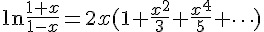

## 泰勒级数 (Taylor series) (作者：Bridan)

許多代數式都可以表示為

  

這稱之為 [泰勒級數](http://zh.wikipedia.org/wiki/%E6%B3%B0%E5%8B%92%E7%BA%A7%E6%95%B0) 展開，如果 a = 0，則改稱為馬克勞林級數展開 (Maclaurin series)

  

如果缺少了這些級數展開，許多電腦數學函數就會計算不出來，在對數一文有一計算式

  

其實它就是一種級數展開，如果電腦要計算三角函數或自然指數，就需要下列算式求值

  

  	

  

  

如果想計算任意值 u 求其任意次方 y，可令

  

  

再求解級數和

(本文來自「研發養成所」 Bridan 的網誌，原文網址為 <http://4rdp.blogspot.tw/2014/07/taylor-series.html> ，由陳鍾誠編輯後納入程式人雜誌)

[超越數 e (Euler's number)]:http://zh.wikipedia.org/wiki/E_(%E6%95%B0%E5%AD%A6%E5%B8%B8%E6%95%B0)
