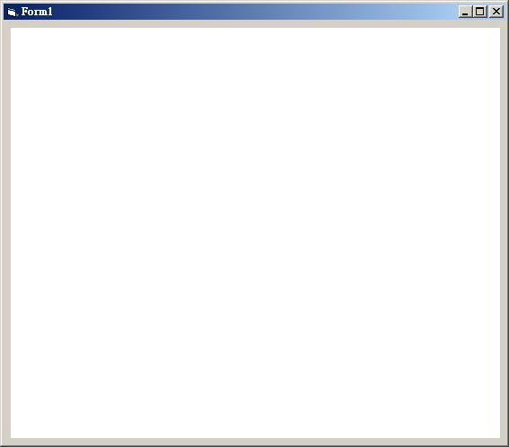

## [Visual Basic 6.0] 利用 WebBrowser 寫 Html 網頁預覽器 (作者：廖憲得 0xde)

首先該如何叫出 WebBrowser 瀏覽器元件呢?
 

 
專案 => 設定使用元件 找到 "Microsoft Internet Controls" 打勾 => 確定
 

 
簡單的 WebBrowser 基礎程式碼

```monobasic
上一頁 WebBrowser1.GoBack 
下一頁 WebBrowser1.GoForward 
瀏覽網址 WebBrowser1.Navigate ("網址") 
重新整理 WebBrowser1.Refresh 
搜索 WebBrowser1.GoSearch 
停止 WebBrowser1.Stop 

```
 
※當出現錯誤訊息：(找不到檔: 'C:\WINDOWS\system32\ieframe.dll\1')


將以下 Code 用記事本填入，並另存新檔為 XXX.reg (登錄檔)

```monobasic
Windows Registry Editor Version 5.00

[HKEY_CLASSES_ROOT\TypeLib\{EAB22AC0-30C1-11CF-A7EB-0000C05BAE0B}]

[HKEY_CLASSES_ROOT\TypeLib\{EAB22AC0-30C1-11CF-A7EB-0000C05BAE0B}\1.1]
@="Microsoft Internet Controls"

[HKEY_CLASSES_ROOT\TypeLib\{EAB22AC0-30C1-11CF-A7EB-0000C05BAE0B}\1.1\0]

[HKEY_CLASSES_ROOT\TypeLib\{EAB22AC0-30C1-11CF-A7EB-0000C05BAE0B}\1.1\0\win32]
@="C:\\WINDOWS\\system32\\ieframe.dll"
```
 


登錄即可。
 

 
Html 網頁預覽器
 
```monobasic
Private Sub HtmlTxt_Change()
Open App.Path & "/Html.htm" For Output As #1

Print #1, HtmlTxt

WebBrowserHtml.Navigate App.Path & "/Html.htm"
Close
End Sub
```

1. 在表單上放置一個 WebBrowser 並且將它重新命名為 WebBrowserHtml
2. 在表單上放置一個 TextBox 並且將它重新命名為 HtmlTxt
 
* 檔案下載：[WebBrowser Html 預覽器.rar](http://files.dotblogs.com.tw/0xde/1311/20131112144644418.rar)

【本文作者為「廖憲得」，原文網址為： <http://www.dotblogs.com.tw/0xde/archive/2013/11/12/127829.aspx> ，由陳鍾誠編輯後納入本雜誌】
