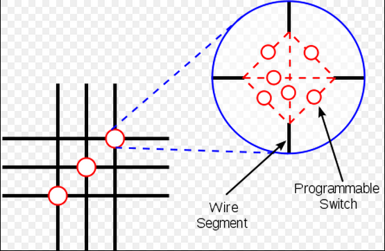

## FPGA 簡介

在目前的數位電路技術當中，FPGA與CPLD是兩種可程式化的電路裝置，其中CPLD是永久性可程式化電路，只要燒錄進去之後就會永久存在，即使關機重開，電路仍然會存在的一種技術。而FPGA則是像 RAM一樣在關機後就會消失的可程式化電路，因此通常會搭配一塊 EPROM ，在開機的時候將電路燒錄到FPGA當中，讓電路看起來就像永久存在一樣。

FPGA 是由一種稱為 CLB (Configurable Logic Block) 或 LAB (Logic Array Block) 的基礎區塊所組成的。下圖是一個 CLB 區塊的典型結構，其中包含一個全加器 (FA)、一個 D-Type 的正反器、三個多工器 (mux) 與兩個三輸入的 Lookup tables (3-LUTs)。

在上圖的 CLB 區塊中，如果走上面的全加器路徑，兩個 3-LUTs 的輸出會被相加，加上 carry-in 之後就成了一組完整的全加器電路。由於該全加器FA的輸入是3-LUTs 的輸出，因此 carry-out 的輸出結果可以寫成如下算式。

> carry-out = FA(carry-in, 3-LUT(a,b,c), 3-LUT(a,b,c))

而且 3-LUT(a,b,c) 的輸出可以是一個三輸入的邏輯真值表，因此可以建構出任意的 a,b,c 等三輸入的邏輯電路組合。

舉例而言，如果兩個 3-LUT 分別是 (a and b) or c 
與 a xor (b and c) 的話，那輸出結果就會是

> carry-out = FA(carry-in, (a and b) or c, a xor (b and c))

當然、如果走下面的 mux 路徑，就不會進行加法運算，而是進行二選一的多工運算，因此會在兩個LUT 的結果當中選擇一個作為輸出。

最後、這個輸出可能會經過 D 正反器 (DFF) 進行儲存動作後再輸出，或者是直接輸出到 out 線路中。

而這些 CLB 區塊會透過下列的 Switch Box 連接形成更大的區塊，每個 Switch Box 的結構如下圖所示。

目前的 FPGA 晶片容量，通常包含數十萬到數百萬個 CLB 邏輯單元，因此已經可以用 FPGA 做出非常複雜的電路，甚至可以將上千顆處理器燒錄到這些 FPGA 晶片中，成為一台超級平行電腦。以下是 Xilinx 公司的 FPGA IC 規格表。

目前FPGA的兩大廠商是 Xilinx 與 Altera，這兩家廠商供應 FPGA IC、開發板與設計工具軟體等產品，而其他的小廠則通常採購這兩家的 IC 放入自己設計的電路板中，因為 IC 的設計與生產成本通常較高，所以小廠通常沒有足夠的經費去設計與量產 FPGA IC。

在開放原始碼的領域，目前我們看到有 Gadget Factory 這家公司釋出了開放的 FPGA 電路板，該公司已經生產了 Papilio One, Papilio Pro 與 Papilio DUO 等三款 FPGA 電路板。 Papilio 電路板的特色是具有模仿 arduino 開發板的功能，並且修改了 arduino 的開發工具，讓您可以在 Papilio FPGA 板中撰寫 arduino 程式。以下是 Papilio One 電路板的圖片。

在台灣，北瀚科技 (SMIMS) 也有設計生產 FPGA 電路板，筆者目前正與北瀚科技洽談有關設計開放原始碼的 FPGA 軟硬體當中，希望可以透過這個合作創建一台從軟體、硬體到 CPU 全部開放的電腦。當然、這將會是一台 FPGA 電腦，這樣的設計雖然效能不見得很好，但是卻會是一台非常適合學校教學研究用的電腦。

筆者已經為這個目標撰寫了一本書，連結如下：

* [開放電腦計畫-計算機硬體結構
(使用 Verilog 實作)](http://ccckmit.github.io/co/htm/book.html)

如果與北瀚科技的合作能成功的話，我們會將「軟體、硬體與書籍」全部都以開放原始碼的方式公開發行。

目前北瀚科技已經釋出了兩塊開放原始碼的電路板在 github 上，網址如下：

* <https://github.com/ccckmit/OpenFpgaBoard>

但是其中有一顆 SMIMS 引擎與對應的程式還沒開放原始碼，所以筆者還在尋求完整開放的可能性，讓台灣的公司也能以更開放的態度面對 open source 社群。

後記：筆者認為、過去幾十年台灣有很好的電腦硬體製造基礎，因此有很多開放硬體的人才，他們有能力設計出像 arduino 或樹莓派 (raspberry Pi) 這樣的硬體與軟體，但是由於缺乏開放原始碼的思維，因此 arduino 與樹莓派都不是台灣的公司或組織所設計出來的。筆者相信、在當今的世界中，開放的心態會是很重要的，透過開放硬體的方式，或許可以為日漸衰落的台灣硬體產業，找到一條全新的道路也說不定。
 
【本文由陳鍾誠取材並修改自 [維基百科]，採用創作共用的 [姓名標示、相同方式分享] 授權】

