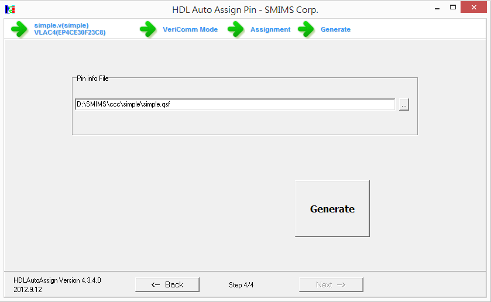

## FPGA 的設計流程與開發工具 -- 使用 Icarus + Altera Quartus II + 北瀚 FPGA 板子

FPGA 是一種可程式化硬體， 所以我們可以「寫程式」燒到FPGA裡面，但是要怎麼寫，又該怎麼燒呢？

撰寫 FPGA 程式通常要採用「硬體描述語言」 (Hardware Description Language, HDL)，目前最常被使用的「硬體描述語言」有兩種，一種是 Verilog，另一種是 VHDL。VHDL 在學術界很常用，很多學校課堂上教授「數位電路設計」或「數位系統設計」的時候都會採用 VHDL；而 Verilog 則是在業界比較常用，而且語法相對精簡，比較不需要重複宣告，因此寫起來很輕鬆愉快，這也是筆者為何喜歡 Verilog 的原因。

當我們寫好一個 Verilog 或 VHDL 程式模組的時候，通常會寫一段稱為 testbench 的測試程式，來測試該模組是否能正常運作，這個過程完全可以在電腦上執行，電腦會根據 Verilog 語法模擬電路的執行過程，不需要立刻燒錄到 FPGA 當中。

舉例而言，開放原始碼的 icarus 是筆者很喜歡使用的 Verilog 模擬測試工具，以下我們就先用 icarus 這個測試工具來說明 verilog 程式的設計與測試流程。

首先，讓我們先撰寫一個超級簡單的模組，並命名為  simple.v 後存檔：

檔案： simple.v

```verilog
module simple(input clock, input i, output o);
  assign o = i;
endmodule
```

上述模組在硬體上其實只是一條線，這條線從 i 點的輸入拉到 o 點的輸出 (雖然還有一個 clock 的參數，但是在此處並未用到，宣告 clock 的原因單純是因為我們接下來要使用的 SMIMS Instrument 工具要求模組必須有時脈 clock 才能連接，所以就多宣告了這個參數，預留給後面綁定時使用的)。

接著、我們就可以另外寫一段測試主程式 (test bench)，並且命名為 simpleTest.v 後存檔:

檔案： simpleTest.v

```verilog
`include "simple.v"

module main;
reg clock, i;
wire o;

simple s1(clock, i, o);

initial begin
  $monitor("%4dns i=%b o=%b", $stime, i, o);
  clock = 0;
  i = 0;
  #30 i=1;
  #100 i=0;
  #100 i=1;
  #100 $finish;
end

always #10 clock=~clock;

endmodule
```

接著我們就可以用 icarus 的 iverilog 指令對 simpleTest.v 這個檔案進行編譯動作，接著再用 vvp 這個指令執行測試程式，過程如下所示：

```
D:\SMIMS\ccc\simple>iverilog simpleTest.v -o simpleTest

D:\SMIMS\ccc\simple>vvp simpleTest
   0ns i=0 o=0
  30ns i=1 o=1
 130ns i=0 o=0
 230ns i=1 o=1
```

當測試完成，模擬結果沒有問題之後，就可以進一步將程式模組真正燒錄到 FPGA 板上去了，在此我們採用北瀚科技 (SMIMS) 的 「VeriLite Altera C4」 FPGA 板作為範例。


由於北瀚科技是小廠，不像 Altera 與 Xilinx 等大廠有自己的 IC 與完整的開發工具，因此北瀚的工具必須搭配上述兩大廠的開發工具使用。

目前、Xilinx 與 Altera 是 FPGA 的兩大廠商，這兩家廠商都提供了FPGA的設計開發工具，Altera 的開發工具稱為 Quartus II，Xilinx 的開發工具稱為 ISE，這兩者都提供了相當完整的工具鏈，包含 Verilog、VHDL、測試檔撰寫、模擬、燒錄、腳位設定等工具。

另外、Xilinx 的 ISE 與 Altera 的 Quartus II 都提供了用圖形化設計模組的方式，設計完之後也可以產生 Verilog 與 VHDL 的程式碼，這種工具有助於學習，但是對於專家而言，直接撰寫程式會是更快速有效的方法。

筆者並沒有購買 Altera Quartus II 軟體，因此使用的是免費的 Quartus II web edition，但是對於初學者而言，這個版本已經是相當好用的了。

以我們上述的 VeriLite Altera C4 FPGA 板為例，我們必須先用 Altera 的 Quartus II 工具來編譯並產生 FPGA 燒錄檔，因此我們必須用 Quartus II 建立一個專案，並在建立時指定使用的 FPGA 晶片型號，相關模組等資訊，然後才能進行編譯，以下是筆者用 Quartus II 編譯 simple.v 完成時的畫面。


但是、FPGA 的「程式設計」流程，與一般程式的設計流程有所不同。在寫一般程式的時候，我們會進行「撰寫、執行」或者「撰寫、編譯、執行」的流程，但是在寫 FPGA 程式的時候，還得加上「腳位綁定」與「燒錄」這兩個步驟。

「腳位綁定」是將 Verilog 模組的輸出入線路，與 FPGA 上的針腳對映起來的一個動作，綁定好之後必須重新進行 FPGA 等級的完整編譯，完成之後才能進行燒錄。

在 北瀚所提供的工具中，HDL Auto Assign Pin 這個工具來進行腳位的自動指定，其操作如下圖所示：




如果我們在編譯時沒有指定腳位資訊，Altera Quartus II 編譯出來就不會包含燒錄檔 (*.rbf)，因此我們可以用上述北瀚 HDL Auto Assign Pin 產生的檔案 simple.qsf 將 Quartus 編譯時預設產生的 simple.qsf  檔覆蓋過去，然後重新編譯一次，這樣才會正確的指定腳位，也才能產生正確的燒錄檔 simple.rbf。

(注意：最好將 北瀚 (SMIMS) 的檔案與 quartus 的檔案分開存放，否則可能會有互相覆蓋的問題)

當燒錄檔 simple.rbf 檔產生之後，我們就可以透過北瀚的 VeriComm 這個工具程式，將 simple.rbf 燒到北瀚的 FPGA 板中，然後編輯輸入波形，並且繪製出實際在 FPGA 板上跑出來的波形圖，如下所示：


我們可以透過 VeriComm 輸出的這個波形看看所設計的 Verilog 程式是否正確，這個波形已經不是模擬的結果了，而是 VeriComm 透過控制 simple.v 的輸入與時脈，實際在 FPGA 板上對每個腳位進行偵測所繪製出來的，也就是讓 simple.v 在 VeriComm 與 SMIMS Engine 晶片控制下的輸出結果。

透過 VeriComm 的波形，我們會比較容易觀察所設計的電路是否正確，這也是北瀚科技比較特別的技術之所在。

接著、我們還可以利用北瀚的 VeriInstrument 工具，利用視覺化的方式，做出一個互動式的「虛擬電路」。舉例而言，以下是我將 simple.v 連結到「按鈕與LED」等圖示控制項，所得到的幾個畫面。


至此、我們已經用一個極度簡單的範例，大致介紹完整個 FPGA 電路的設計過程，希望能讓大家對 FPGA 的電路設計有完整的概念。當然、學習 FPGA 的過程有些是很難以文字表達的，因此筆者錄了以下這些影片，希望能幫助讀者更生動的理解整個 FPGA 的電路設計的動態過程。

* [YouTube 影片：FPGA 電路設計流程:用北瀚的板子示範 1 (整體流程介紹)](https://www.youtube.com/watch?v=D-sN2yndQjU)
* [YouTube 影片：FPGA 電路設計流程:用北瀚的板子示範 2 (icarus) ](https://www.youtube.com/watch?v=JDBZTwId_rM)
* [YouTube 影片：FPGA 電路設計流程:用北瀚的板子示範 3 (quartus) ](https://www.youtube.com/watch?v=9t9KOP1BaCc)
* [YouTube 影片：FPGA 電路設計流程:用北瀚的板子示範 4 (pin assign)](https://www.youtube.com/watch?v=_eRo4fxQ8no)
* [YouTube 影片：FPGA 電路設計流程:用北瀚的板子示範 5 (veriComm 波形偵測驗證)](https://www.youtube.com/watch?v=wlB9zyU6TOs)
* [YouTube 影片：FPGA 電路設計流程:用北瀚的板子示範 6 (用veriInstrument  接上虛擬周邊)](http://youtu.be/Fs5M8fsQrTw)

【本文由陳鍾誠取材並修改自 [維基百科]，採用創作共用的 [姓名標示、相同方式分享] 授權】

