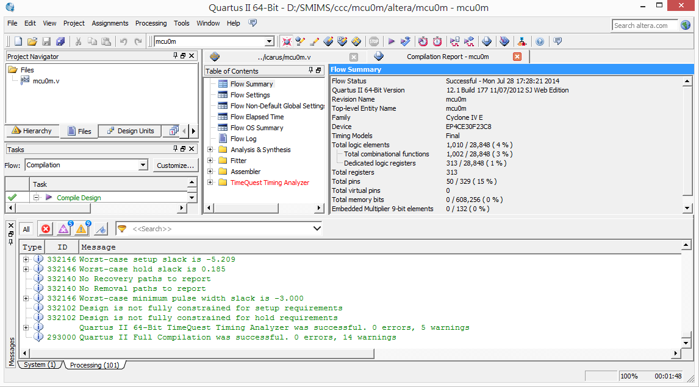

## 開放電腦計畫 (13) -- 將 MCU0 放上 FPGA 執行

### 前言

先前我們曾經用流程式撰寫法設計過 MCU0 的迷你版與完整版，也曾經用區塊式的方法設計過 MCU0 的迷你版，這些文章列表如下：

* [開放電腦計畫 (6) – 一顆只有 51 行 Verilog 程式碼的 16 位元處理器 MCU0](https://dl.dropboxusercontent.com/u/101584453/pmag/201312/htm/article5.html)
* [開放電腦計畫 (7) – 完整指令集的 16 位元處理器 MCU0s](http://programmermagazine.github.io/201401/htm/article5.html)
* [開放電腦計畫 (12) – 使用區塊式方法設計 MCU0 的 Verilog 程式](http://programmermagazine.github.io/201407/htm/article5.html)

但是在這些文章中，我們都只用 icarus  去跑模擬測試，並沒有真正將 MCU0 放到 FPGA 上面跑，所以我們將在本文當中用北瀚的 FPGA 版來運行 MCU0 迷你版，讓 MCU0 真正成為「硬體」。

### 修改程式並模擬測試

為了讓 MCU0 能上 FPGA 跑， 我們必須修改一些程式，主要是因為 Verilog 在模擬的時候可以跑 initial 區段，但上 FPGA 時就沒有辦法執行initial 區段，也沒有用 readmemh() 辦法讀取機器碼的十六進位檔了。

因此、我們只好加上重置訊號 reset ，並將機器碼在 reset 時直接塞入記憶體中，於是整個程式改寫如下：

檔案：muc0m.v

```verilog
`define N    SW[15] // 負號旗標
`define Z    SW[14] // 零旗標
`define OP   IR[15:12] // 運算碼
`define C    IR[11:0]  // 常數欄位
`define M    {m[`C], m[`C+1]}

module mcu0m(input reset, input clock, output reg [15:0] A, output reg [15:0] IR, output reg [15:0] PC); 
  parameter [3:0] LD=4'h0,ADD=4'h1,JMP=4'h2,ST=4'h3,CMP=4'h4,JEQ=4'h5;
  reg [15:0] SW;  // 狀態暫存器
  reg [15:0] pc0;
  reg [7:0]  m [0:32];   // 內部的記憶體
  
  always @(posedge clock or posedge reset) begin 
    if (reset) begin
      PC = 0;
      SW = 0;       
      {m[0],m[1]}   = 16'h0016;  // 00    LOOP:   LD    I    
      {m[2],m[3]}   = 16'h401A;  // 02            CMP   K10  
      {m[4],m[5]}   = 16'h5012;  // 04            JEQ   EXIT
      {m[6],m[7]}   = 16'h1018;  // 06            ADD   K1   
      {m[8],m[9]}   = 16'h3016;  // 08            ST    I    
      {m[10],m[11]} = 16'h0014;  // 0A            LD    SUM  
      {m[12],m[13]} = 16'h1016;  // 0C            ADD   I    
      {m[14],m[15]} = 16'h3014;  // 0E            ST    SUM  
      {m[16],m[17]} = 16'h2000;  // 10            JMP   LOOP
      {m[18],m[19]} = 16'h2012;  // 12    EXIT:   JMP   EXIT
      {m[20],m[21]} = 16'h0000;  // 14    SUM:    WORD  0    
      {m[22],m[23]} = 16'h0000;  // 16    I:      WORD  0    
      {m[24],m[25]} = 16'h0001;  // 18    K1:     WORD  1    
      {m[26],m[27]} = 16'h000A;  // 1A    K10:    WORD  10            
    end else begin
      IR = {m[PC], m[PC+1]};  // 指令擷取階段：IR=m[PC], 2 個 Byte 的記憶體
      pc0= PC;                // 儲存舊的 PC 值在 pc0 中。
      PC = PC+2;              // 擷取完成，PC 前進到下一個指令位址
      case (`OP)              // 解碼、根據 OP 執行動作
        LD: A = `M;           // LD C
        ST: `M = A;           // ST C
        CMP: begin `N=(A < `M); `Z=(A==`M); end // CMP C
        ADD: A = A + `M;      // ADD C
        JMP: PC = `C;         // JMP C
        JEQ: if (`Z) PC=`C;   // JEQ C
      endcase
      // 印出 PC, IR, SW, A 等暫存器值以供觀察
      $display("%4dns PC=%x IR=%x, SW=%x, A=%d", $stime, pc0, IR, SW, A); 
     end
  end
endmodule
```

先前我們通常將「模組與測試程式」寫在一起，但是為了放上 FPGA，我們決定把「模組與測試程式」分開，然後在測試程式當中用 include 的方式引用模組。

檔案：mcu0mTest.v

```verilog
`include "mcu0m.v"

module main;                // 測試程式開始
reg clock, reset;           
wire [15:0] A, IR, PC, SW;
mcu0 mcu(reset, clock, A, IR, PC);   // 宣告 cpu0mc 處理器

initial begin 
  clock = 0;          // 一開始 clock 設定為 0
  #10;
  reset = 1;
  #30;
  reset = 0;
end
always #10 clock=~clock;   // 每隔 10ns 反相，時脈週期為 20ns
initial #2000 $finish;     // 在 2000 奈秒的時候停止測試。
endmodule
```

接著、讓我們用 icarus 測試看看這個程式的運作是否正常，測試過程如下：

```
D:\SMIMS\ccc\mcu0m\icarus>iverilog mcu0mTest.v -o mcu0mTest

D:\SMIMS\ccc\mcu0m\icarus>vvp mcu0mTest
  50ns PC=0000 IR=0016, SW=0000, A=    0
  70ns PC=0002 IR=401a, SW=8000, A=    0
  90ns PC=0004 IR=5012, SW=8000, A=    0
 110ns PC=0006 IR=1018, SW=8000, A=    1
 130ns PC=0008 IR=3016, SW=8000, A=    1
 150ns PC=000a IR=0014, SW=8000, A=    0
 170ns PC=000c IR=1016, SW=8000, A=    1
 190ns PC=000e IR=3014, SW=8000, A=    1
 210ns PC=0010 IR=2000, SW=8000, A=    1
 230ns PC=0000 IR=0016, SW=8000, A=    1
 250ns PC=0002 IR=401a, SW=8000, A=    1
 270ns PC=0004 IR=5012, SW=8000, A=    1
 290ns PC=0006 IR=1018, SW=8000, A=    2
 310ns PC=0008 IR=3016, SW=8000, A=    2
 330ns PC=000a IR=0014, SW=8000, A=    1
 350ns PC=000c IR=1016, SW=8000, A=    3
 370ns PC=000e IR=3014, SW=8000, A=    3
 390ns PC=0010 IR=2000, SW=8000, A=    3
 410ns PC=0000 IR=0016, SW=8000, A=    2
 430ns PC=0002 IR=401a, SW=8000, A=    2
 450ns PC=0004 IR=5012, SW=8000, A=    2
 470ns PC=0006 IR=1018, SW=8000, A=    3
 490ns PC=0008 IR=3016, SW=8000, A=    3
 510ns PC=000a IR=0014, SW=8000, A=    3
 530ns PC=000c IR=1016, SW=8000, A=    6
 550ns PC=000e IR=3014, SW=8000, A=    6
 570ns PC=0010 IR=2000, SW=8000, A=    6
 590ns PC=0000 IR=0016, SW=8000, A=    3
 610ns PC=0002 IR=401a, SW=8000, A=    3
 630ns PC=0004 IR=5012, SW=8000, A=    3
 650ns PC=0006 IR=1018, SW=8000, A=    4
 670ns PC=0008 IR=3016, SW=8000, A=    4
 690ns PC=000a IR=0014, SW=8000, A=    6
 710ns PC=000c IR=1016, SW=8000, A=   10
 730ns PC=000e IR=3014, SW=8000, A=   10
 750ns PC=0010 IR=2000, SW=8000, A=   10
 770ns PC=0000 IR=0016, SW=8000, A=    4
 790ns PC=0002 IR=401a, SW=8000, A=    4
 810ns PC=0004 IR=5012, SW=8000, A=    4
 830ns PC=0006 IR=1018, SW=8000, A=    5
 850ns PC=0008 IR=3016, SW=8000, A=    5
 870ns PC=000a IR=0014, SW=8000, A=   10
 890ns PC=000c IR=1016, SW=8000, A=   15
 910ns PC=000e IR=3014, SW=8000, A=   15
 930ns PC=0010 IR=2000, SW=8000, A=   15
 950ns PC=0000 IR=0016, SW=8000, A=    5
 970ns PC=0002 IR=401a, SW=8000, A=    5
 990ns PC=0004 IR=5012, SW=8000, A=    5
1010ns PC=0006 IR=1018, SW=8000, A=    6
1030ns PC=0008 IR=3016, SW=8000, A=    6
1050ns PC=000a IR=0014, SW=8000, A=   15
1070ns PC=000c IR=1016, SW=8000, A=   21
1090ns PC=000e IR=3014, SW=8000, A=   21
1110ns PC=0010 IR=2000, SW=8000, A=   21
1130ns PC=0000 IR=0016, SW=8000, A=    6
1150ns PC=0002 IR=401a, SW=8000, A=    6
1170ns PC=0004 IR=5012, SW=8000, A=    6
1190ns PC=0006 IR=1018, SW=8000, A=    7
1210ns PC=0008 IR=3016, SW=8000, A=    7
1230ns PC=000a IR=0014, SW=8000, A=   21
1250ns PC=000c IR=1016, SW=8000, A=   28
1270ns PC=000e IR=3014, SW=8000, A=   28
1290ns PC=0010 IR=2000, SW=8000, A=   28
1310ns PC=0000 IR=0016, SW=8000, A=    7
1330ns PC=0002 IR=401a, SW=8000, A=    7
1350ns PC=0004 IR=5012, SW=8000, A=    7
1370ns PC=0006 IR=1018, SW=8000, A=    8
1390ns PC=0008 IR=3016, SW=8000, A=    8
1410ns PC=000a IR=0014, SW=8000, A=   28
1430ns PC=000c IR=1016, SW=8000, A=   36
1450ns PC=000e IR=3014, SW=8000, A=   36
1470ns PC=0010 IR=2000, SW=8000, A=   36
1490ns PC=0000 IR=0016, SW=8000, A=    8
1510ns PC=0002 IR=401a, SW=8000, A=    8
1530ns PC=0004 IR=5012, SW=8000, A=    8
1550ns PC=0006 IR=1018, SW=8000, A=    9
1570ns PC=0008 IR=3016, SW=8000, A=    9
1590ns PC=000a IR=0014, SW=8000, A=   36
1610ns PC=000c IR=1016, SW=8000, A=   45
1630ns PC=000e IR=3014, SW=8000, A=   45
1650ns PC=0010 IR=2000, SW=8000, A=   45
1670ns PC=0000 IR=0016, SW=8000, A=    9
1690ns PC=0002 IR=401a, SW=8000, A=    9
1710ns PC=0004 IR=5012, SW=8000, A=    9
1730ns PC=0006 IR=1018, SW=8000, A=   10
1750ns PC=0008 IR=3016, SW=8000, A=   10
1770ns PC=000a IR=0014, SW=8000, A=   45
1790ns PC=000c IR=1016, SW=8000, A=   55
1810ns PC=000e IR=3014, SW=8000, A=   55
1830ns PC=0010 IR=2000, SW=8000, A=   55
1850ns PC=0000 IR=0016, SW=8000, A=   10
1870ns PC=0002 IR=401a, SW=4000, A=   10
1890ns PC=0004 IR=5012, SW=4000, A=   10
1910ns PC=0012 IR=2012, SW=4000, A=   10
1930ns PC=0012 IR=2012, SW=4000, A=   10
1950ns PC=0012 IR=2012, SW=4000, A=   10
1970ns PC=0012 IR=2012, SW=4000, A=   10
1990ns PC=0012 IR=2012, SW=4000, A=   10
```

您可以看到上述的測試結果中，1+2+...+10 的結果 55 正確的被計算出來了。

### 放上 FPGA 實際執行

接著、就讓我們將程式放到北瀚科技 (SMIMS) 的 「VeriLite Altera C4」 FPGA 板上去執行，以下是該 FPGA 版的樣子。


由於北瀚的開發工具必須搭配 Altera 的 Quartus II 使用，所以我們必須先將 mcu0m.v 先用 Quartus II 建立專案並且編譯過之後，才能用北瀚的 VeriComm 工具進行燒錄與執行監控等任務，以下是我們用 Quartus II 編譯時的畫面。



接著我們用北瀚的 HDL Auto Assign Pin 工具產生腳位綁定檔，以下是腳位綁定時的一個畫面。


然後我們將產生的 mcu0m.qsf 檔案複製到  Quartus II 專案中，重新編譯過即可產生燒錄檔 mcu0m.rbf 檔。

接著開啟 VeriComm 並進行燒錄，可以看到該 FPGA 在 VeriComm 監控模式下輸出的波形圖如下。


您可以看到該結果中正確的計算出 1+2+...+10 = 55 的結果，這代表我們的 mcu0m 模組確實可以放上 FPGA 並且正確的運作了。

### 結語

必須注意的是，北瀚的 HDL Auto Assign Pin 由於是他們自己寫的一個簡易 Verilog 剖析器，並沒有支援完整的 Verilog 語法，因此在剖析 mcu0m.v 時有失敗的情況，因此筆者將 mcu0m.v 的內容全部刪除之後才交給  HDL Auto Assign Pin 剖析，如此就能正確產生腳位對應檔。

(或許北瀚應該考慮改用 icarus 的剖析器，這樣應該就不用自己辛苦的寫剖析器，也可以支援完整的語法了)

上述編譯、燒錄與執行過程還算蠻漫長的，所以筆者將自己的操作過程錄影了下來，如果本文描述還有不清楚的地方，可以進一步參考下列影片。

* [YouTube 影片：開放電腦計畫 - 將 MCU0m 放上北瀚的 FPGA 板執行](http://youtu.be/BXoOSgG_j18)

【本文由陳鍾誠取材並修改自 [維基百科]，採用創作共用的 [姓名標示、相同方式分享] 授權】

